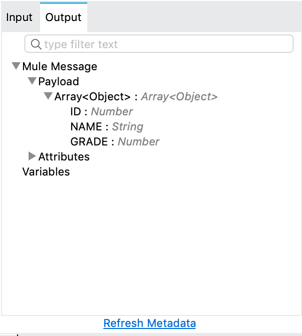

= Query a Database - Mule 4
ifndef::env-site,env-github[]
include::_attributes.adoc[]
endif::[]

When you configure a Database operation using the Database connector, there are several ways to add variable values to the SQL statement you execute in the database.

== Use Input Parameters to Protect Database Queries

The `db:select` operation is used to retrieve information from the RDBMS, by supplying a
`db:sql` parameter with the SQL query to execute and a `db:input-parameters` parameter
with a DataWeave script that creates a map with the query parameters:

[source,xml,linenums]
----
<flow name="selectParameterizedQuery">
  <db:select config-ref="dbConfig">
    <db:sql>SELECT * FROM PLANET WHERE name = :name</db:sql>
    <db:input-parameters>
      #[{'name' : payload}]
    </db:input-parameters>
  </db:select>
</flow>
----

As you can see in the above example, input parameters are supplied as key-value pairs, which you can create by embedding a DataWeave script. Those keys are used in conjunction with the semicolon character (`:`) to reference a parameter value by name. This is the recommended approach for using parameters in your query.

[TIP]
*Since version 1.4.0 (escaping semi-colons)*:
If you need to use the semicolon character (`:`) in your SQL Query, you can escape it
by putting a backslash before it. This is useful, for example, when using PostgreSQL type
casting, which requires two semicolons before the type you are casting to, for example:
`<db:sql>SELECT price\:\:float8 FROM PRODUCT</db:sql>`

The advantages of using input parameters to configure the `WHERE` clause in a `SELECT` statement are:

* The query becomes immune to SQL injection attacks.
* The connector can perform optimizations that are not possible otherwise, which improves the app’s overall performance.

The alternative is to directly write `<db:sql> SELECT * FROM PLANET WHERE name =
#[payload] </db:sql>`, but this is a very dangerous practice that is not recommended because
you lose the advantages aforementioned.

[TIP]
DataSense is available for the operation's input and output. By analyzing
the query, the connector will automatically calculate the structure of the
query's output by analyzing the projection section of the SQL statement. At
the same time, by comparing the conditions in the `WHERE` clause to the table
structure, it will also generate DataSense input to help you build the
DataWeave script that generates the input parameters map.

== Dynamic Queries

Sometimes, you not only need to parameterize the `WHERE` clause, but also parameterize
parts of the query itself. Examples of use cases for this are queries that need to hit online
versus historic tables that depend on a condition, or complex queries where the project
columns need to vary.

In this example, you can see how a full expression is used to produce the query by
building a string in which the table depends on the value of the `$(vars.table)` variable.
An important thing to notice is that although some of the query text is dynamic `"SELECT *
FROM $(vars.table)`, the WHERE clause is following the best practice of defining the `WHERE`
condition using input parameters, in this case `WHERE name = :name`:

[source,xml,linenums]
----
<set-variable variableName="table" value="PLANET"/>
<db:select config-ref="dbConfig">
    <db:sql>#["SELECT * FROM $(vars.table) WHERE name = :name"]</db:sql>
    <db:input-parameters>
        #[{'name' : payload}]
    </db:input-parameters>
</db:select>
----

[NOTE]
In Mule 3, the concept of SELECT was split in parameterized and dynamic
queries, and you could not use both at the same time. You had to choose
between having a dynamic query or having the advantages of using
parameters (SQL Injection protection, PreparedStatement optimization, and
so on). Furthermore, the syntax to do one or the other was different, so you
had to learn two different ways of doing the same thing. But with the
Database Connector in Mule 4, you can now use both methods at the same
time by using expressions in the query, as shown in the above example.

[CAUTION]
You might be wondering: Why do I need to use Mule variables to build
my dynamic queries like the example above? Can't I just treat the table
like another Input parameter? The answer is no. Input parameters
can only be applied to parameters in a `WHERE` clause. To modify any other
part of the query, you need to use https://docs.mulesoft.com/mule-runtime/4.2/dataweave-types#string_interpolation[DataWeave’s interpolation operator].

== Streaming Large Results

Database tables tend to be big. One single query might return tens of thousands of records, especially when dealing with integration use cases. Streaming is a great solution for this. What does streaming mean? Suppose you have a query which returns 10K rows, attempting to fetch all those rows at once will result in the following:

* Performance degradation, since that’s a big pull from the network
* A risk of running out of memory, since all that information needs to be loaded into RAM.

Streaming means that the connector will not fetch the 10K rows at once; instead, it will
fetch a smaller chunk, and once that chunk has been consumed it will go fetch the rest.
That way, you can reduce pressure over the network and memory. You can specify the
size of the streaming chunks with the `fetchSize` parameter, which indicates how many
rows to fetch from the database in each chunk.

[NOTE]
The `fetchSize` is only a hint to the JDBC driver and therefore is not always
enforced. The behavior varies between JDBC driver providers. Often, the
default `fetchSize` for a JDBC driver is `10`.

=== Stream in Mule 4 versus Stream in Mule 3

In Mule 3.x, streaming was something you had to specifically enable because it was disabled by default. In Mule 4, streaming is transparent and always enabled. You don’t have to worry about it anymore. You can simply trust that the feature is there.

Another improvement from Mule 3 is that you can now use the new repeatable streams mechanism from Mule 4. This means that streams are now repeatable, and you can have DataWeave and other components process the same stream many times, even in parallel. For more information on repeatable streams, see xref:4.1@mule-runtime::streaming-about.adoc[Streaming in Mule 4.0].

== Limit Results

Mule runtime allows the connector to handle streaming gracefully. However, that does
not mean that it's a good idea to move unlimited chunks of data from the database to Mule.
Even with streaming, a typical SQL query usually returns many rows, each one containing a
lot of information. This generates:

* Large network overhead
* A large resources footprint on the database server
* Large memory and requirements in the Mule Runtime

To control this, the `Select` operation provides a `maxRows` parameter, which sets the
maximum number of rows that will be retrieved by the operation. If the limit is exceeded,
the excess rows are silently dropped.

== Example with fetchSize and maxRows

The combination of these two parameters limits the total amount of information that will
be retrieved by the query (through the `maxRows` parameter) and tries to fetch the data over the
network in chunks of a certain size (through the `fetchSize` parameter).

[source,xml,linenums]
----
<db:select fetchSize="200" maxRows="1000" config-ref="dbConfig">
  <db:sql>select * from some_table</db:sql>
</db:select>
----

This example tells the connector to fetch no more than 1000 rows as the result of the
`SELECT` query and also to stream the results to the Database connector in chunks of 200
rows at a time. Therefore, it would require 5 separate network round trips to
retrieve 1000 matching rows.

== Set a Query Timeout

Sometimes database queries take a long time to execute. The following factors often cause delays in query execution:

* An inefficient query, such as one having improper indexing that iterates over many rows.
* A busy RDBMS or busy network.
* A lock contention.

Generally, it's recommended to set a timeout on the query. To manage timeouts,
configure `queryTimeout` and `queryTimeoutUnit`. No timeout is used by default. The
following example shows how to set a timeout for the Select operation, but all operations
support setting a timeout:

[source,xml,linenums]
----
<db:select queryTimeout="10" queryTimeoutUnit="SECONDS" config-ref="dbConfig">
   <db:sql>select * from some_table</db:sql>
</db:select>
----

To explore the possible values for the `queryTimeoutUnit` parameter, check `Select` in the Operations section of
the https://docs.mulesoft.com/connectors/database/database-documentation#operations[Database Connector Reference]

[NOTE]
It is worth mentioning that the `queryTimeout` parameter indicates the
minimum amount of time before the JDBC driver attempts to cancel a
running statement. This means that this timeout does not account for the
time spent due to travel in the network, nor the time the Mule Runtime
spends parsing the results or loading them into memory.

== Processing Query Output

Suppose we run the following query to obtain the id, name and grade fields from the
students table.

[source,xml,linenums]
----
<db:select config-ref="dbConfig">
   <db:sql>SELECT id, name, grade FROM students</db:sql>
</db:select>
----

The output of this query will be saved in the payload as an collection (array) of objects. With the help
of DataSense, we can view the metadata for the output and see the object's fields (id, name
and grade) and their type (String, Number).

In the next component of our flow, if we want to access the `name` field for the first record
of the collection we would do it with the following DataWeave script: `#[payload[0].ID]`;
and with DataSense we will get autocompletion options when we are typing it:

image::../../assets/images/db/fields-autocomplete.png[]

Another common scenario is performing a specific action for each of the records of the
collection. For an example of that, check the https://docs.mulesoft.com/mule-runtime/4.2/for-each-scope-concept[For Each Scope].

== See Also

* xref:4.1@mule-runtime::streaming-about.adoc[Streaming in Mule 4]