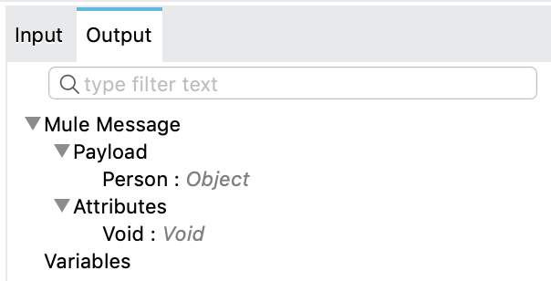

= Example: To Create an Instance of a Class
ifndef::env-site,env-github[]
include::_attributes.adoc[]
endif::[]
:keywords: Java, create instance

== Calling Java Constructors

Let's suppose we have the following Java class `Person` which belongs to the `com.foo` package:

[source,java,linenums]
----
package com.foo;

public class Person {

    private String name;
    private Integer age;

    public Person() {
        this.name = "Max Mule";
        this.age = 10;
    }

    public Person(String name, Integer age) {
        this.name = name;
        this.age = age;
    }
}
----

IMPORTANT: The classes used with the Java Module must be exported (unless they belong to the default package). If not, the
execution will fail with a JAVA:CLASS_NOT_FOUND error. See xref:4.1@mule-runtime::how-to-export-resources.adoc[How to
export resources].

We can call these constructors using the `new` operation of the Java Module.

This example shows how to create an instance of Person using the constructor that does not require parameters:

[source,xml,linenums]
----
<java:new class="com.foo.Person" constructor="Person()"/>
----

Otherwise, if we want to create a Person object using the constructor that
requires parameters, we would do:

[source,xml,linenums]
----
<java:new class="com.foo.Person" constructor="Person(String, Integer)">
    <java:args>#[{
      name: 'Jhon Doe',
      age: 30
    }]</java:args>
</java:new>
----

For the constructor parameters, you can also specify the full package name, for example
`constructor="Person(java.lang.String, java.lang.Integer)"`. Of course, this is not needed, but it can
be useful it you want more clarity in your code or you have clashing class names in your Java code.

[IMPORTANT]
===============================
When configuring the constructor arguments in the `args` parameter,
the keys of the map will determine how the parameters will be passed to the constructor. *In
order to reference the parameters by name* (`firstName`, `age`, etc.),
the java class containing the Method or Constructor has to be compiled
using https://docs.oracle.com/javase/tutorial/reflect/member/methodparameterreflection.html[the `-parameters` compiler flag].
If the class was not compiled with this flag, then the same parameters
must be referenced in the declared order and with the canonical names
(`arg0`, `arg1`, etc.). In this case:
[source,xml,linenums]
----
<java:args>#[{
  arg0: 'Jhon Doe',
  arg1: 30
}]</java:args>
----

If your Java classes are defined in your Studio Project, you will need to add
the Maven Compiler plugin as a dependency in you `pom.xml` in order to compile your classes
with the `-parameters` flag:
[source,xml,linenums]
----
<plugin>
    <groupId>org.apache.maven.plugins</groupId>
    <artifactId>maven-compiler-plugin</artifactId>
    <version>3.8.1</version>
    <configuration>
        <compilerArgs>
            <arg>-parameters</arg>
        </compilerArgs>
    </configuration>
</plugin>
----
===============================

== DataSense Support in Studio

One of the advantages of using the Java Module is that you will get https://docs.mulesoft.com/studio/7.3/datasense-concept[DataSense] support,
which can help you build the `args` map, which serves as input for the `new` operation.

For that, once we set the class to `com.foo.Person` and the operation
to `Person(String, Integer)` on the new operation, we can then click on the Show Graphical View icon image:../../assets/images/java/graphical-view.png[30, 30].
Assuming that the previous component in the flow outputs a map with `name` and `age` keys (such as
https://docs.mulesoft.com/mule-runtime/4.1/set-payload-transformer-reference[Set Payload]), you will see this:

image::../../assets/images/java/matching-input.png[]

Here you can match the fields by dragging and dropping from the left to the right. Doing so will produce:

image::../../assets/images/java/matched-input.png[]

Now we have our `new` operation configured and ready.

DataSense will also provide Metadata for the operation's output. As we can see,
the `new` operation will place the the `Person` object in the payload:

== Target Parameters

If you would rather save the output object to a variable, the `new` operation supports
https://docs.mulesoft.com/mule-runtime/4.2/target-variables[target parameters],
as the following example shows:

[source,xml,linenums]
----
<java:new class="com.foo.Person" constructor="Person(String, Integer)" target="john">
    <java:args>#[{
      name: 'Jhon Doe',
      age: 30
    }]</java:args>
</java:new>
----

You can later access that object as `"#[vars.john]"`.

== Further Reading

xref:java/java-invoke-method.adoc[Example: To Invoke Methods]

xref:java/java-instanceof.adoc[Example: To Test for an Instance of a Class]

xref:java/java-throwable.adoc[Example: Working With Throwable]