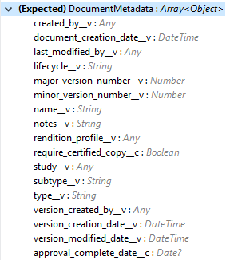
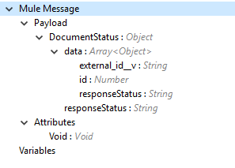
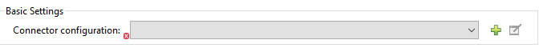
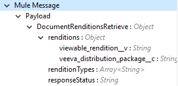
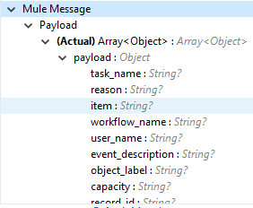

= VeevaVault Connector Additional Configuration Information - Mule 4
ifndef::env-site,env-github[]
include::_attributes.adoc[]
endif::[]

=== Use the Connector in a Mule Flow:

Following are the list of operations with the connector and its configurations:

*Documents*

* link:#create-documents[*Create Documents*]
* link:#get-documents[*Get Documents*]
* link:#delete-documents[*Delete Documents*]
* link:#update-documents[*Update Documents*]
* link:#export-documents[*Export Documents*]

*Document Renditions*

* link:#create-document-renditions[*Create Document Renditions*]
* link:#get-document-renditions-types[*Get Document Renditions Types*]
* link:#delete-document-renditions[*Delete Document Renditions*]

*Vault Objects*

* link:#create-object-records[*Create Object Records*]
* link:#get-object-records[*Get Object Records*]
* link:#delete-object-records[*Delete Object Records*]
* link:#update-object-records[*Update Object Records*]

*VQL Query*

* link:#query[*Query*]

*Picklists*

* link:#get-picklists[*Get Picklists*]

*Audit*

* link:#get-audit-details[*Get Audit Details*]

*Spark Messaging*

* link:#spark-validator[*Spark Validator*]

==== Create Documents

The Create Documents operation allows to create single or multiple document(s) with provided document metadata in CSV or JSON format. Make sure you have uploaded document files on Vault FTP server location for document content to attach with created documents.

*Configurations:*

*Connector Configuration:*

image::veevavault/veevavault-connector-basic-configuration.png[image,width=601,height=54]

*Follow the instructions in xref:veevavault-connector-reference.adoc#veevavault-connector-connection-config[Connector Configuration]*

*Operation Configuration:*

image::veevavault/veevavault-connector-create-documents.png[image,width=601,height=90]

[cols=",",options="header",]
|===
|Field |Description
|Metadata Format |Select CSV or JSON option to accept document metadata in specified format.
|Document Metadata |Document Metadata payload with required metadata either in CSV or JSON format. Make sure payload would be in format as specified in Metadata format field.
|Input a|
You can find following list of document metadata required to create document(s) on vault. Make sure payload should have mandatory metadata as per vault.

|Output a|
You can find create documents operation output status or response from vault.

Note : It’s important to check response status of Success and Failure of operation in section link:#connector-operations-success-and-failure-response[*Connector Operations SUCCESS and FAILURE Response*].

|===

==== Get Documents

The Get Documents operation allows to retrieve document details based on document type, subtype and classification selected. Using selected type, subtype and classification it fetches document properties metadata and builds VQL queries dynamically. The VQL query is then executed on Vault to retrieve document details. Place For-Each/Splitter element after this Operation to fetch each document data (page) sequentially.

Note – The output of the operation would be in pagination mechanism, please refer to link:#streaming-and-pagination[*Streaming and Pagination*] for more details.

The document type, subtype and classification are optional, if none are selected then document properties metadata are fetched using API *(/api/\{version}/metadata/objects/documents/properties)* and VQL Query is built based on document metadata properties added/inserted in Document Properties list, if metadata properties are not provided then all queryable document properties is used in VQL and executed.

*Configurations:*

*Connector Configuration:*

*Follow the instructions mentioned in link:veevavault-connector-reference.adoc#veevavault-connector-connection-config[Connector Configuration]*

*Operation Configuration:*

image:../../assets/images/veevavault/veevavault-connector-get-documents.png[image,width=601,height=355]

[%header%autowidth.spread]
|===
|Fields |Description
|Type (Optional) |Click on icon image:../../assets/images/veevavault/veevavault-connector-refresh-icon.png[image,width=22,height=22] to retrieve Document Types from vault. Select a document type from the list to retrieve document properties.
|Subtype (Optional) |Click on icon image:../../assets/images/veevavault/veevavault-connector-refresh-icon.png[image,width=22,height=22] to retrieve Document Subtypes from vault. Select a document subtype from the list to retrieve document properties.
|Classification (Optional) |Click on icon image:../../assets/images/veevavault/veevavault-connector-refresh-icon.png[image,width=22,height=22] to retrieve Document Classification from vault. Select a document classification from the list to retrieve document properties.
|Document Properties (Optional) |Insert document properties as per business requirement and these properties will be used to build a VQL query to execute on vault.
|WHERE Clause |Insert a https://developer.veevavault.com/vql/#introduction-to-vault-queries[VQL] WHERE clause (without using keyword WHERE) conditions as per business requirement and it will be appended to dynamically to build VQL query to execute on vault. *E.g classification__v = ‘study_set_up_worksheet__c’*
|Fetch Size |Provide number of records per page. Default is 1000.
|Batch Size |Provide number of pages per batch. Default is 10.
|Input |N/A
|Output a|
You can find list of queryable document properties retrieved from vault. If document properties list is provided, then specified properties detail would retrieve and result in operation output. Default would be list of all queryable properties.

image::veevavault/veevavault-connector-get-documents-output.png[image,width=288,height=313]

|===

==== Delete Documents

The Delete Documents operation allows to delete document single or multiple document(s) with bulk API using CSV or JSON format input metadata.

*Configurations:*

*Connector Configuration:*

image::veevavault/veevavault-connector-basic-configuration.png[image,width=601,height=54]

Follow the instructions in xref:veevavault-connector-reference.adoc#veevavault-connector-connection-config[Connector Configuration].

*Operation Configuration:*

image::veevavault/veevavault-connector-delete-documents.png[image,width=601,height=90]

[cols=",",options="header",]
|===
|Field |Description
|Metadata Format |Select CSV or JSON option to accept document metadata in specified format.
|Document Metadata |Document Metadata payload with required metadata either in CSV or JSON format.
|Input a|
You can find following list of document metadata required to delete document(s) on vault.

image::veevavault/veevavault-connector-delete-documents-input.png[image,width=301,height=55]

|Output a|
You can find delete documents operation output status or response from vault.

image::veevavault/veevavault-connector-delete-documents-output.png[image,width=300,height=147]

*Note : It’s important to check response status of Success and Failure of operation in section link:#connector-operations-success-and-failure-response[Connector Operations SUCCESS and FAILURE Response].*

|===

==== Update Documents

The Update Documents operation allows to update bulk documents with provided editable metadata in payload either in CSV or JSON format.

*Configurations:*

*Connector Configuration:*

*Follow the instructions mentioned in link:veevavault-connector-reference.adoc#veevavault-connector-connection-config[Connector Configuration]*

*Operation Configuration:*

image:../../assets/images/veevavault/veevavault-connector-update-documents.png[image,width=601,height=95]

[cols=",",options="header",]
|===
|Field |Description
|Metadata Format |Select CSV or JSON option to accept document metadata in specified format.
|Document Metadata |Document Metadata payload with required editable metadata either in CSV or JSON format. Make sure payload would be in format as specified in Metadata format field.
|Input a|
You can find following list of editable document metadata to update document(s) on vault. Make sure payload should have only editable metadata as per vault.

image::veevavault/veevavault-connector-update-documents-input.png[image,width=286,height=343]

|Output a|
You can find create documents operation output status or response from vault.

image::veevavault/veevavault-connector-update-documents-output.png[image,width=303,height=148]

|===

==== Export Documents

An Export Documents operation allows to query a set of documents for export to your vault’s FTP Staging server. It is recommended to use Export Documents operation is separate asynchronous flow using Async Scope and passing payload with document ids. Using asynchronously the operation executes in separate flow thread, will wait for specified polling interval to poll the Job status until it gets successful while the main flow continues its process.

The exported documents are stored on FTP Staging area in folder hierarchy structure – *\{root}/\{userId}/\{jobId}/\{documentIds}/\{versions}*. The Export Documents operation will return job results as response. For example:
--------------------
[
  {
	"file": "/41601/249051/0_1/TestDocument.docx",
	"user_id__v": 1885110,
	"id": 249051,
	"responseStatus": "SUCCESS",
	"minor_version_number__v": 1,
	"major_version_number__v": 0
  },
  {
	"file": "/41601/249050/0_1/TestDocument.docx",
	"user_id__v": 1885110,
	"id": 249050,
	"responseStatus": "SUCCESS",
	"minor_version_number__v": 1,
	"major_version_number__v": 0
  },
  {
	"file": "/41601/249052/0_1/TestDocument.docx",
	"user_id__v": 1885110,
	"id": 249052,
	"responseStatus": "SUCCESS",
	"minor_version_number__v": 1,
	"major_version_number__v": 0
  }
]
--------------------

The previous example shows attributes as under :
 
*file – "/{jobId}/{documentId}/{major-minor-version}/{filename}"*. It’s an absolute file path location on Vault FTP server staging area.
 
*user_id__v* –  It’s a Vault system user Id of an user whose credentials are configured in connector. The folder is created in the name of user Id prefix with *‘u’ (e.g: uXXXXXXX)* on Vault FTP server staging area root location and under which exported file is located – *(e.g: "/uXXXXXXX/{jobId}/{documentId}/{major-minor-version}/{filename}\)"*.

*id* – It’s a document Id of exported document file.

*major_version_number__v* – It’s a major version number of exported document file.

*minor_version_number__v* – It’s a minor version number of exported document file.

*Configurations:*

*Connector Configuration:*

image::veevavault/veevavault-connector-basic-configuration.png[image,width=601,height=54]

Follow the instructions mentioned in link:#configuration[*Connector Configuration*]

*Operation Configuration:*

image:../../assets/images/veevavault/veevavault-connector-export-documents.png[image,width=601,height=221]

[cols=",",options="header",]
|===
|*Field* |*Description*
|*Metadata Format* |Select CSV or JSON option to accept metadata document Id in specified format.
|*Document Metadata* |Document Metadata payload contains document Ids in either in CSV or JSON format. Make sure payload would be in format as specified in Metadata format field.
|*Source* |Optional, to exclude source files set to false. Default is true.
|*Renditions* |Optional, to include renditions set to true. Default is false.
|*All Versions* |Optional, to include all versions or latest version set to true. Default is false.
|*Polling Interval* |Optional, to polls vault at specified interval in seconds until job is successful. Default is 30 seconds.
|*Input* a|
You can find following input document metadata required to export document(s) from vault to FTP staging server. Make sure payload should have mandatory metadata as per vault.

image:../../assets/images/veevavault/veevavault-connector-export-documents-input.png[image,width=297,height=90]

|*Output* a|
You can find export documents job status response under output tab.

image:../../assets/images/veevavault/veevavault-connector-export-documents-output.png[image,width=288,height=256]

*Note : Its important to check response status of Success and Failure of operation in section link:#connector-operations-success-and-failure-response[Connector Operations SUCCESS and FAILURE Response].*

|===

==== Create Document Renditions:

The Create Document Renditions operation allows to add document renditions in bulk. Your vault must be in Migration Mode before using this operation. It takes maximum CSV input data of size 1GB with value in standard UTF-8 encoded.

*Configurations:*

*Connector Configuration:*

*Follow the instructions mentioned in link:veevavault-connector-reference.adoc#veevavault-connector-connection-config[Connector Configuration]*

*Operation Configuration:*

image:../../assets/images/veevavault/veevavault-connector-create-document-renditions.png[image,width=601,height=90]

[cols=",",options="header",]
|===
|*Field* |*Description*
|*Metadata Format* |Select CSV or JSON option to accept document metadata in specified format.
|*Document Metadata* |Document Metadata payload with required metadata either in CSV or JSON format. Make sure payload would be in format as specified in Metadata format field.
|*Input* a|
You can find following list of document metadata required in payload under Input tab of operation.

image:../../assets/images/veevavault/veevavault-connector-create-document-renditions-input.png[image,width=280,height=188]

|*Output* a|
You can find following operation output or response under Output tab.

image:../../assets/images/veevavault/veevavault-connector-create-document-renditions-output.png[image,width=283,height=202]

*Note* : It’s important to check response status of Success and Failure of operation in section link:#connector-operations-success-and-failure-response[*Connector Operations SUCCESS and FAILURE Response*].

|===

==== Get Document Renditions Types

The Get Document Renditions Types operation allows to retrieve document renditions types detail.

*Configurations:*

*Connector Configuration:*

Follow the instructions mentioned in link:#configuration[*Connector Configuration*]

*Operation Configuration:*

image:../../assets/images/veevavault/veevavault-connector-get-document-renditions-types.png[image,width=601,height=61]

[cols=",",options="header",]
|===
|*Field* |*Description*
|*Document Metadata* |Document Id in payload either in CSV or JSON format.
|*Input* a|
You can see document Id required in payload under Input tab of operation to retrieve document renditions details

image:../../assets/images/veevavault/veevavault-connector-get-document-renditions-types-input.png[image,width=293,height=38]

|*Output* a|
You can find following operation output or response under Output tab.

*Note* : It’s important to check response status of Success and Failure of operation in section link:#connector-operations-success-and-failure-response[*Connector Operations SUCCESS and FAILURE Response*].

|===

==== Delete Document Renditions

The Delete Document Renditions operation allows to delete document renditions in bulk using CSV or JSON format input metadata.

*Configurations:*

*Connector Configuration:*

Follow the instructions mentioned in link:#configuration[*Connector Configuration*]

*Operation Configuration:*

image:../../assets/images/veevavault/veevavault-connector-delete-document-renditions.png[image,width=601,height=90]

[cols=",",options="header",]
|===
|*Field* |*Description*
|*Metadata Format* |Select CSV or JSON option to accept document metadata in specified format.
|*Document Metadata* |Document Metadata payload with required metadata either in CSV or JSON format.
|*Input* a|
You can find following list of document metadata required to create document(s) on vault. Make sure payload should have mandatory metadata as per vault.

image::veevavault/veevavault-connector-delete-document-renditions-input.png[image,width=283,height=122]

|*Output* a|
You can find delete document renditions operation output status or response from vault.

image::veevavault/veevavault-connector-delete-document-renditions-output.png[image,width=285,height=208]

*Note* : It’s important to check response status of Success and Failure of operation in section link:#connector-operations-success-and-failure-response[*Connector Operations SUCCESS and FAILURE Response*].

|===

==== Create Object Records

The Create Object Records operation allows to create bulk object records for selected vault object with provided object metadata in CSV or JSON format.

*Configurations:*

*Connector Configuration:*

image::veevavault/veevavault-connector-basic-configuration.png[image,width=601,height=54]

Follow the instructions mentioned in link:#configuration[*Connector Configuration*]

*Operation Configuration:*

image::veevavault/veevavault-connector-object-records.png[image,width=601,height=112]

[cols=",",options="header",]
|===
|*Field* |*Description*
|*Object Name* |Click on icon image:../../assets/images/veevavault/veevavault-connector-refresh-icon.png[image,width=22,height=22] to retrieve vault object list. Select the object name from the list to create records for selected object.
|*Metadata Format* |Select CSV or JSON option to accept object metadata in specified format.
|*Object Metadata* |Object fields payload with required metadata either in CSV or JSON format. Make sure payload would be in format as specified in Metadata format field.
|*Input* a|
You can find following list of object metadata required to create object records.

image::veevavault/veevavault-connector-create-object-records-input.png[image,width=283,height=330]

|*Output* a|
You can find operation output or response retrieved from vault for an object records created.

image::veevavault/veevavault-connector-create-object-records-output.png[image,width=296,height=163]

*Note* : It’s important to check response status of Success and Failure of operation in section link:#connector-operations-success-and-failure-response[*Connector Operations SUCCESS and FAILURE Response*].

|===

==== Get Object Records

The Get Object Records operation allows to retrieve object records detail using object metadata fields to build a VQL query dynamically and execute on vault to get Object details. Place For-Each/Splitter element after this Operation to fetch each object records (page) sequentially.

Note – The output of the operation would be in pagination mechanism, please refer to link:#streaming-and-pagination[*Streaming and Pagination*] for more details.

*Configurations:*

*Connector Configuration:*

image::veevavault/veevavault-connector-basic-configuration.png[image,width=601,height=54]

Follow the instructions mentioned in link:#configuration[*Connector Configuration*]

*Operation Configuration:*

image::veevavault/veevavault-connector-get-object-records.png[image,width=601,height=355]

[cols=",",options="header",]
|===
|*Fields* |*Description*
|*Vault Object* |Click on icon image:../../assets/images/veevavault/veevavault-connector-refresh-icon.png[image,width=22,height=22] to retrieve vault objects list from vault. Select an object from the list to retrieve object records detail.
|*Object Fields* (Optional) |Insert object fields as per business requirement and these fields will be used to build a VQL query to execute on vault.
|*WHERE Clause* |Insert a https://developer.veevavault.com/vql/#introduction-to-vault-queries[VQL] WHERE clause (without using keyword WHERE) conditions as per business requirement and it will be appended to dynamically to build VQL query to execute on vault. *E.g study_country__v = ‘0SC000000000101’*
|*Fetch Size* |Provide number of records per page. Default is 1000.
|*Batch Size* |Provide number of pages per batch. Default is 10.
|*Input* |N/A
|*Output* a|
You can find the list of object records fields to refer to add into Object fields list. If object fields list is provided, then specified fields detail returns as output. Default would be list of all fields.

image::veevavault/veevavault-connector-get-object-records-output.png[image,width=282,height=306]

|===

==== Delete Object Records

The Delete Object Records operation allows to delete single or multiple object record(s) with bulk API using CSV or JSON format input metadata.

*Configurations:*

*Connector Configuration:*

image::veevavault/veevavault-connector-basic-configuration.png[image,width=601,height=54]

Follow the instructions mentioned in link:#configuration[*Connector Configuration*]

*Operation Configuration:*

image::veevavault/veevavault-connector-object-records.png[image,width=601,height=112]

[cols=",",options="header",]
|===
|*Field* |*Description*
|*Object Name* |Click on icon image:../../assets/images/veevavault/veevavault-connector-refresh-icon.png[image,width=22,height=22] to retrieve vault object list. Select the object name from the list to delete object records for selected object.
|*Metadata Format* |Select CSV or JSON option to accept document metadata in specified format.
|*Object Metadata* |Object fields payload with required metadata either in CSV or JSON format. Make sure payload would be in format as specified in Metadata format field.
|*Input* a|
You can find following list of object metadata required to delete object records.

image::veevavault/veevavault-connector-delete-object-records-input.png[image,width=300,height=70]

|*Output* a|
You can find operation output or response retrieved from vault for an object records deleted.

image::veevavault/veevavault-connector-delete-object-records-output.png[image,width=303,height=110]

*Note* : It’s important to check response status of Success and Failure of operation in section link:#connector-operations-success-and-failure-response[*Connector Operations SUCCESS and FAILURE Response*].

|===

==== Update Object Records

The Update Object Records operation allows to update object records of specified vault object.

*Configurations:*

*Connector Configuration:*

image::veevavault/veevavault-connector-basic-configuration.png[image,width=601,height=54]

Follow the instructions mentioned in link:#configuration[*Connector Configuration*]

*Operation Configuration:*

image::veevavault/veevavault-connector-object-records.png[image,width=601,height=112]

[cols=",",options="header",]
|===
|*Field* |*Description*
|*Object Name* |Click on icon image::veevavault/veevavault-connector-refresh-icon.png[image,width=22,height=22] to retrieve vault object list. Select the object name from the list to update object records of vault object.
|*Metadata Format* |Select CSV or JSON option to accept object metadata in specified format.
|*Object Metadata* |Object fields payload with required metadata either in CSV or JSON format. Make sure payload would be in format as specified in Metadata format field.
|*Input* a|
You can find following list of object metadata required to create object records.

image::veevavault/veevavault-connector-update-object-records-input.png[image,width=283,height=346]

|*Output* a|
You can find object status of an object updated as an output or response retrieved from vault under output tab of operation.

image::veevavault/veevavault-connector-update-object-records-output.png[image,width=281,height=112]

*Note* : It’s important to check response status of Success and Failure of operation in section link:#connector-operations-success-and-failure-response[*Connector Operations SUCCESS and FAILURE Response*].

|===

==== Query

The Query Operation allows to execute specified VQL query on Vault and retrieve result in paginated data input stream. Place For-Each/Splitter after Query Operation to fetch each record in sequence order. Note - Do not specify LIMIT and OFFSET in VQL query. These parameters are incorporated internally.

Note – The output of the operation would be in pagination mechanism, please refer to link:#streaming-and-pagination[*Streaming and Pagination*] for more details.

*Configurations:*

*Connector Configuration:*

image::veevavault/veevavault-connector-basic-configuration.png[image,width=601,height=54]

Follow the instructions mentioned in link:#configuration[*Connector Configuration*]

*Operation Configuration:*

image::veevavault/veevavault-connector-query.png[image,width=595,height=355]

[cols=",",options="header",]
|===
|*Field* |*Description*
|*VQL Query* a|
Enter https://developer.veevavault.com/vql/#introduction-to-vault-queries[VQL] query to send it to Vault.

*Note -- Do not specify LIMIT and OFFSET in VQL query.*

|*Input Parameters* a|
The input parameters are to pass parameter(s) to VQL query dynamically. The parameters should be name-value pair, payload or variables value can be pass. Eg.

____
#[
	{
		'table': 'site__v',
	}
]
____

Default parameter is *#[{}].*

|*Fetch Size* |Provide number of records per page. Default is 1000.
|*Batch Size* |Provide number of pages per batch. Default is 10.
|*Input* |N/A
|*Output* a|
You can find the specified VQL query fields in output tab of operation. It returns specified VQL query result contains pagination data.

image::veevavault/veevavault-connector-query-output.png[image,width=305,height=145]

|===

*Use Input Parameters to Protect VQL Queries*

The Query operation is used to retrieve documents, object, workflow information from the Vault. The primary concept of this operation is to supply a VQL query and use DataWeave to supply the parameters:

In the above example, input parameters are supplied as key-value pairs, which you can create by embedding a DataWeave script. Those keys are used in conjunction with the semicolon character (:) to reference a parameter value by name. This is the recommended approach for using parameters in your VQL query.

The alternative is to directly write ` *<veevavault:vql>SELECT id, name__v, study__v FROM documents WHERE name__v = #[payload] </veevavault:vql>`*, but this is a very dangerous practice that is not recommended.

*Advantages of using input parameters to configure the WHERE clause in a SELECT statement this way:*

* The query becomes immune to VQL injection attacks.
* The connector can perform optimizations that are not possible otherwise, which improves the app’s overall performance.

==== Get Picklists

The Get Picklists operation allows to retrieve all available picklist values configured on a picklist.

*Configurations:*

*Connector Configuration:*

image::veevavault/veevavault-connector-basic-configuration.png[image,width=601,height=54]

Follow the instructions mentioned in link:#configuration[*Connector Configuration*]

*Operation Configuration:*

image:../../assets/images/veevavault/veevavault-connector-get-picklists.png[image,width=601,height=60]

[cols=",",options="header",]
|===
|*Field* |*Description*
|*Picklist Name* (Optional) |Click on icon image:../../assets/images/veevavault/veevavault-connector-refresh-icon.png[image,width=22,height=22] to retrieve picklists from vault. Select a picklist name from the list to retrieve picklist values.
|*Input* |N/A
|*Output* a|
You can find picklist values with name and label as an output of Get Picklists operation.

image:../../assets/images/veevavault/veevavault-connector-get-picklists-output.png[image,width=284,height=91]

|===

==== Get Audit Details

The Get Audit Detail operation allows to retrieve audit details for specified audit type.

Note – The output of the operation would be in pagination mechanism, please refer to link:#streaming-and-pagination[*Streaming and Pagination*] for more details.

*Configurations:*

*Connector Configuration:*

Follow the instructions mentioned in link:#configuration[*Connector Configuration*]

*Operation Configuration:*

image:../../assets/images/veevavault/veevavault-connector-get-audit-details.png[image,width=600,height=179]

[cols=",",options="header",]
|===
|*Field* |*Description*
|*Audit Type* |Click on icon image:../../assets/images/veevavault/veevavault-connector-refresh-icon.png[image,width=22,height=22] to retrieve audit types from vault. Select an audit type from the list whose audit details need to retrieve.
|*Start date* |Optional, specify start date to retrieve audit information. This date cannot be more than 30 days ago. Dates must be YYYY-MM-DDTHH:MM:SSZ format. Dates and times are in UTC. If time is not specified, it will default to midnight (T00:00:00Z) on the specified date.
|*End date* |Optional, specify end date to retrieve audit information. This date cannot be more than 30 days ago. Dates must be YYYY-MM- DDTHH:MM:SSZ format. Dates and times are in UTC. If time is not specified, it will default to midnight (T00:00:00Z) on the specified date.
|*Fetch Size* |Provide number of records per page. Default is 1000.
|*Batch Size* |Provide number of pages per batch. Default is 10.
|*Input* |N/A
|*Output* a|
The following selected audit type details retrieved from vault in pagination format. Make sure to use For each / Splitter to fetch each record.

|===

==== Spark Validator

The Spark Validator operation validates and verify spark message triggered from Vault with signature and public key. On successful validation and verification, the Spark message can be process further in Mule Flow as per business requirements. You can refer to https://developer.veevavault.com/sdk/#spark-messaging[Spark Messaging feature and functionalities] and setup for more details.

The output of Spark Validator operation is Spark attributes (optional) with Spark Message as it is received from Vault.

*Note* – Before triggering Spark message from Vault make sure to raise support ticket with Veeva Support to increase the time interval (say – 10 seconds) for Spark Message to resend/retry. By default, it is configured as 3 seconds which is less for Spark Validator to complete message validation and verification.

*Note* – As per Veeva Systems the public key (00001.pem) expires every two years. The customer gets notification well advanced about its expiry date, if you are using this operation in Mule application flow make sure that after public key expiration date you need to remove public key file from the path configured in field (Public Key Path) and it will create new public key file while execution. Otherwise Spark message verification would be failing as *INVALID_SPARK_MESSAGE*. The Mule application deployed on Cloudhub with default path need to restart for successful Spark Message verification.

*Configurations:*

*Connector Configuration:*

Follow the instructions mentioned in link:#configuration[*Connector Configuration*]

*Operation Configuration:*

image:../../assets/images/veevavault/veevavault-connector-spark-validator.png[image,width=600,height=195]

[cols=",",options="header",]
|===
|*Field* |*Description*
|*Include Spark Header*|Flag to include Spark headers received from Vault into Spark Validator output. Default is FALSE.
|*Public Key Path*|The path where public key (00001.pem) file get saved and will be used for verifying incoming Spark message with Signature. Default is *“${mule.home}/apps/${app.name}/publickeys”*
|*Spark Headers*|The Spark headers received from the Vault. Default is *#[attributes.headers]*
|*Spark Message*|The Spark message body received from the Vault. Default is *#[payload]*.
|*Input*|You can find the following inputs required for Spark Validator.

image:../../assets/images/veevavault/veevavault-connector-spark-validator-input.png[image,width=285,height=330]

|*Output*|You can find the following output returns from Spark Validator operation.

image:../../assets/images/veevavault/veevavault-connector-spark-validator-output.png[image,width=280,height=265]

|===

=== Connector Operations SUCCESS and FAILURE response

The Veeva Vault Connector operation responses are based on the Veeva API success or failure response with an error. The connector returns SUCCESS response at HIGH LEVEL and SUCCESS or FAILURE at LOW LEVEL (it means connector operation is SUCCESS but some to documents/object records failed to create/update due to some irrelevant metadata pass in request. For e.g.:

* *SUCCESS with SUCCESS response*
--------------------
{

"responseStatus": "SUCCESS"
	"data":[
		{
			"id": 239026,
			"name__v": "E22611234--38483",
			"responseStatus": "SUCCESS"
		},
		{
			"id": 239025,
			"name__v": "Kick-off Meeting Material Updated12341234--81032",
			"responseStatus": "SUCCESS"
		}
	]
}
--------------------

* *SUCCESS with a FAILURE response*

--------------------
{
	"data": [
		{
			"external_id__v": "TEST-238924",
			"rendition_type__v": "imported_rendition__c",
			"id": 238924,
			"responseStatus": "FAILURE",
			"minor_version_number__v": 1,
			"errors": [
				{
					"type": "INVALID_DATA",
					"message": "Document not found [238924/0/1]."
				}
			],
			"major_version_number__v": 0
		},
		{
			"external_id__v": "TEST-238925",
			"rendition_type__v": "imported_rendition__c",
			"id": 238925,
			"responseStatus": "FAILURE",
			"minor_version_number__v": 1,
			"errors": [
				{
					"type": "INVALID_DATA",
					"message": "Document not found [238925/0/1]."
				}
			],
			"major_version_number__v": 0
		}
	],
	"responseStatus": "SUCCESS"
}
--------------------

The Veeva Vault operations throw an exception when Veeva APIs returns a FAILURE response. E.g:

* *FAILURE with an ERROR response*
--------------------
{
	"responseStatus": "FAILURE",+
	"errors": [
		{
			"type": "INVALID_DATA",
			"message": "Unknown relationship [reviewer__v]"
		}
	]
}
--------------------
On receiving above FAILURE response from Veeva APIs, the connector operations will throw an exception, which needs to be caught in Error Handling component within Mule flow. E.g.:

--------------------
**********************************************************************************
Message : An error occurred from the Veeva Vault API.
Error Code: INVALID_DATA.
Original Error Message: Unknow relationship [reviewer__v].
Error type : VEEVAVAULT:INVALID_DATA
**********************************************************************************
--------------------

Following are the Error codes that can be caught in Error Handling component

* VEEVAVAULT:API_LIMIT_EXCEEDED
* VEEVAVAULT:ATTRIBUTE_NOT_SUPPORTED
* VEEVAVAULT:INACTIVE_USER
* VEEVAVAULT:INVALID_DATA
* VEEVAVAULT:INVALID_DOCUMENT
* VEEVAVAULT:INSUFFICIENT_ACCESS
* VEEVAVAULT:MALFORMED_URL
* VEEVAVAULT:METHOD_NOT_SUPPORTED
* VEEVAVAULT:NO_PERMISSION
* VEEVAVAULT:OPERATION_NOT_ALLOWED
* VEEVAVAULT:PARAMETER_REQUIRED

=== Streaming and Pagination

All the operations (except Download Document) in connector returns an InputStream as payload with respective results based on operation output. Because of an InputStream is returned as payload Mule by default applies Streaming Strategies, please refer to https://docs.mulesoft.com/mule-runtime/4.2/streaming-about[Mule Streaming Strategies] in more details. You can find streaming strategies configuration in *Advanced* tab of connector operations.

image:../../assets/images/veevavault/veevavault-connector-streaming-pagination.png[image,width=601,height=124]

The following operations in connector provides pagination mechanism based on Mule standard pagination.

* link:#get-documents[*Get Documents*]
* link:#get-object-records[*Get Object Records*]
* link:#query[*Query*]
* link:#get-audit-details[*Get Audit Details*]

While using these above paginated operations make sure to place For-Each/Splitter to retrieve each object (metadata’s in JSON format) at a time. The pagination operations have fields – *Fetch Size and Batch Size.*

* *Fetch Size:* The Fetch Size is a limit number of records that can be retrieve in a page. The operation would return the pages with fetch size number of JSON object records. Note, in some cases, Veeva API’s auto-calculate fetch size (number of records on each page) based on record size accumulated exceed the standard record size. The operation will return calculated records on each page.
* *Batch Size:* The Batch Size is number of pages it would return in each batch and each page will have fetch size number of records. The operation would return number of records (metadata’s in JSON format) per batch is calculated as below, *e.g*.:
--------------------
Fetch Size set as *1000*
Batch Size set as *10*

Total records in vault say has *100,000* records then

Number of pages = Total records/Fetch Size
				= 100000/1000
				= 100 pages.
				
Number of pages per batch 	= Number of pages/Batch Size
							= 100/10
							= 10 pages per batch.
							
Number of Records per batch = Number of pages per batch * Fetch Size
							= 10 * 1000
							= 10,000 records.
							
Therefore, Number of records return per batch would be 10,000 records.
--------------------

The repeatable streams measure the buffer size in byte measurements, when handling objects the runtime measures the buffer size using instance counts.

In non-repeatable stream connector operation would returns stream as number of records per batch and in repeatable stream would returns all records in once, so when calculating the in-memory buffer size for repeatable auto-paging, you need to estimate how much memory space each instance takes to avoid running out of memory.		

== Next Step

After you complete configuring the connector, you can try the xref:./veevavault-connector-examples.adoc[Examples].

== See Also

https://help.mulesoft.com[MuleSoft Help Center]
