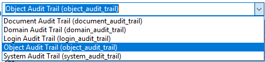
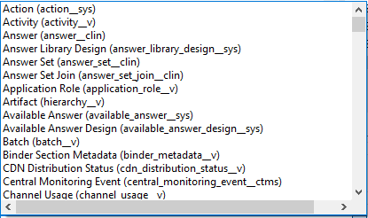
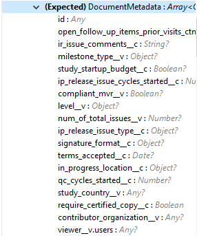

= Veeva Vault Connector Reference - Mule 4
ifndef::env-site,env-github[]
include::_attributes.adoc[]
endif::[]

Support Category: https://www.mulesoft.com/legal/versioning-back-support-policy#anypoint-connectors[Select]

Veeva Vault Connector v1.1.0

== Configuration

=== Connection Configuration

[%header%autowidth.spread]
|===
|*Name* |*Type* |*Description* |*Default Value* |*Required*
|Name |String |The name for this configuration. Connectors reference the configuration with this name. | |X
|Vault URL |String |The URL of the Veeva Vault instance required for connection | |X
|Username |String |Username used to initialize the session | |X
|Password |String |Password used to authenticate the user | |X
|Version |String |Veeva Vault API version |v19.1 |
|Client Id |String |The Client Id that need to send with each request header to Vault instance in format - \{company}-\{organization}-\{server}-\{component}. E.g veeva-clinical-mulesoft-connector | |X
|===

=== Response Timeout (Advanced Tab)

[%header%autowidth.spread]
|===
|*Name* |*Type* |*Description* |*Default Value* |*Required*
|Response Timeout |Integer |Maximum time, in milliseconds, that the connector waits for the Veeva Vault response. If the time elapses a `Response Timeout` exception is thrown. | `30000 ms` |X
|===

=== Burst API Limit Profile (Advanced Tab)
`<veevavault:burst-api-limit-profile/>`

The Burst API Limit Profile to configure API limit threshold for evaluation with remaining burst API limit calls. Once burst API limit calls reach or exceed the specified threshold limit, connector would wait for specified time period. By default, its disable. For more information refer *https://developer.veevavault.com/docs/#api-rate-limits[API Rate Limit Headers].*

[%header%autowidth.spread]
|===
|*Name* |*Type* |*Description* |*Default Value* |*Required*
|API Limit Threshold |Integer |The API Limit Threshold value to set number of API Limit Calls mark as threshold. Once threshold reached, connector warns burst API limit exceed and will wait for specified time period. |200 |X
|Wait Time |Integer |Time the connector will wait once threshold value is reached or exceeds the remaining API calls. | `5` |X
|Time Unit a|
* DAYS
* HOURS
* MINUTES
* SECONDS
* MILISECONDS
* NANOSECONDS

| | `MINUTES` |X
|===

=== Daily API Limit Profile (Advanced Tab)
`<veevavault:daily-api-limit-profile/>`

The Daily API Limit Profile to configure API limit threshold for evaluation with remaining daily API limit calls. Once daily API limit calls reach or exceed the specified threshold limit an exception is thrown. By default, its disable. For more information refer *https://developer.veevavault.com/docs/#api-rate-limits[API Rate Limit Headers].*

[%header%autowidth.spread]
|===
|*Name* |*Type* |*Description* |*Default Value* |*Required*
|API Limit Threshold |Integer |The API Limit Threshold value to set number of API Limit Calls mark as threshold. Once threshold reached, connector will throw an API_LIMIT_EXCEED exception for each request invoking an API calls. |10000 |X
|===

== Operations

* link:#create-documents[*Create Documents*]
* link:#create-document-renditions[*Create Document Renditions*]
* link:#create-object-records[*Create Object Records*]
* link:#delete-document-renditions[*Delete Document Renditions*]
* link:#delete-documents[*Delete Documents*]
* link:#delete-object-records[*Delete Object Records*]
* link:#export-documents[*Export Documents*]
* link:#get-audit-details[*Get Audit Details*]
* link:#get-document-renditions-types[*Get Document Renditions*]
* link:#get-documents[*Get Documents*]
* link:#get-object-records[*Get Object Records*]
* link:#get-picklists[*Get Picklists*]
* link:#query[*Query*]
* link:#spark-validator[*Spark Validator*]
* link:#update-documents[*Update Documents*]
* link:#update-object-records[*Update Object Records*]

=== Create Documents
`<veevavault:create-documents>`

This operation creates documents on Veeva Vault using document metadata provided in CSV or JSON format.

==== Parameters

[%header%autowidth.spread]
|===
|*Name* |*Type* |*Description* |*Default Value* |*Required*
|Metadata Format a|
Enum (String)

* CSV
* JSON

|Metadata format either CSV or JSON. | |X
|Document Metadata |Input Stream a|
The document metadata either in CSV OR JSON format as Input Stream respective to Metadata format option selected. Metadata as below:

image:veevavault/veevavault-connector-create-documents-input.png[]

| |X
|===

==== Configurations

link:#veevavault-connector-connection-config[Connection Configuration]

==== Throws

* VEEVAVAULT:API_LIMIT_EXCEEDED
* VEEVAVAULT:ATTRIBUTE_NOT_SUPPORTED
* VEEVAVAULT:INACTIVE_USER
* VEEVAVAULT:INVALID_DATA
* VEEVAVAULT:INVALID_DOCUMENT
* VEEVAVAULT:INSUFFICIENT_ACCESS
* VEEVAVAULT:MALFORMED_URL
* VEEVAVAULT:METHOD_NOT_SUPPORTED
* VEEVAVAULT:NO_PERMISSION
* VEEVAVAULT:OPERATION_NOT_ALLOWED
* VEEVAVAULT:PARAMETER_REQUIRED

=== Create Document Renditions
`<veevavault:create-document-renditions>`

Create Document Renditions on vault with provided metadata in CSV/JSON format.

==== Parameters

[%header%autowidth.spread]
|===
|*Name* |*Type* |*Description* |*Default Value* |*Required*
|Metadata Format a|
Enum (String)

* CSV
* JSON

|Metadata format either CSV or JSON. | |X
|Document Metadata |Input Stream a|
The document metadata either in CSV OR JSON format as Input Stream respective to Metadata format option selected. Metadata as below:

image:veevavault/veevavault-connector-create-document-renditions-input.png[]

| |X
|===

*For Configurations:*

link:#veevavault-connector-connection-config[Connection Configuration]

*Throws:*

* VEEVAVAULT:API_LIMIT_EXCEEDED
* VEEVAVAULT:ATTRIBUTE_NOT_SUPPORTED
* VEEVAVAULT:INACTIVE_USER
* VEEVAVAULT:INVALID_DATA
* VEEVAVAULT:INVALID_DOCUMENT
* VEEVAVAULT:INSUFFICIENT_ACCESS
* VEEVAVAULT:MALFORMED_URL
* VEEVAVAULT:METHOD_NOT_SUPPORTED
* VEEVAVAULT:NO_PERMISSION
* VEEVAVAULT:OPERATION_NOT_ALLOWED
* VEEVAVAULT:PARAMETER_REQUIRED

=== Create Object Records
`<veevavault:create-object-records>`

Create Object Records creates an object records in bulk on vault using object metadata either in CSV or JSON format.

==== Parameters

|===
|*Name* |*Type* |*Description* |*Default Value* |*Required*
|Object Name |String a|
The list of all vault objects available to select anyone from the list. For e.g

image:veevavault/veevavault-connector-create-object-records-object-name.png[]

| |X
|Metadata Format a| String |Metadata format, either CSV or JSON | |X
|Object Metadata |Input Stream a|
The object metadata, either in CSV OR JSON format as the Input Stream respective to the Metadata format option selected. Metadata is shown in the following image:

image:veevavault/veevavault-connector-create-object-records-input.png[]

| |X
|===

==== For Configurations

link:#veevavault-connector-connection-config[Connection Configuration]

==== Throws

* VEEVAVAULT:API_LIMIT_EXCEEDED
* VEEVAVAULT:ATTRIBUTE_NOT_SUPPORTED
* VEEVAVAULT:INACTIVE_USER
* VEEVAVAULT:INVALID_DATA
* VEEVAVAULT:INVALID_DOCUMENT
* VEEVAVAULT:INSUFFICIENT_ACCESS
* VEEVAVAULT:MALFORMED_URL
* VEEVAVAULT:METHOD_NOT_SUPPORTED
* VEEVAVAULT:NO_PERMISSION
* VEEVAVAULT:OPERATION_NOT_ALLOWED
* VEEVAVAULT:PARAMETER_REQUIRED

=== Delete Document Renditions
`<veevavault:delete-document-renditions>`

Delete document renditions from vault based on document renditions metadata provided in CSV or JSON format.

==== Parameters

[%header%autowidth.spread]
|===
|*Name* |*Type* |*Description* |*Default Value* |*Required*
|Metadata Format a|
Enum (String)

* CSV
* JSON

|Metadata format either CSV or JSON. | |X
|Document Metadata |Input Stream a|
The document metadata either in CSV OR JSON format as Input Stream respective to Metadata format option selected. Metadata as below:

image:veevavault/veevavault-connector-delete-document-renditions-input.png[]

| |X
|===

==== For Configurations

link:#veevavault-connector-connection-config[Connection Configuration]

==== Throws

* VEEVAVAULT:API_LIMIT_EXCEEDED
* VEEVAVAULT:ATTRIBUTE_NOT_SUPPORTED
* VEEVAVAULT:INACTIVE_USER
* VEEVAVAULT:INVALID_DATA
* VEEVAVAULT:INVALID_DOCUMENT
* VEEVAVAULT:INSUFFICIENT_ACCESS
* VEEVAVAULT:MALFORMED_URL
* VEEVAVAULT:METHOD_NOT_SUPPORTED
* VEEVAVAULT:NO_PERMISSION
* VEEVAVAULT:OPERATION_NOT_ALLOWED
* VEEVAVAULT:PARAMETER_REQUIRED

=== Delete Documents
`<veevavault:delete-documents>`

Delete documents delete documents from vault based on metadata document *Ids* provided in CSV or JSON format.

==== Parameters

[%header%autowidth.spread]
|===
|*Name* |*Type* |*Description* |*Default Value* |*Required*
|Metadata Format a|
Enum (String)

* CSV
* JSON

|Metadata format either CSV or JSON. | |X
|Document Metadata |Input Stream a|
The document metadata either in CSV OR JSON format as Input Stream respective to Metadata format option selected. Metadata as below:

image:veevavault/veevavault-connector-delete-documents-input.png[]

| |X
|===

==== For Configurations

link:#veevavault-connector-connection-config[Connection Configuration]

==== Throws

* VEEVAVAULT:API_LIMIT_EXCEEDED
* VEEVAVAULT:ATTRIBUTE_NOT_SUPPORTED
* VEEVAVAULT:INACTIVE_USER
* VEEVAVAULT:INVALID_DATA
* VEEVAVAULT:INVALID_DOCUMENT
* VEEVAVAULT:INSUFFICIENT_ACCESS
* VEEVAVAULT:MALFORMED_URL
* VEEVAVAULT:METHOD_NOT_SUPPORTED
* VEEVAVAULT:NO_PERMISSION
* VEEVAVAULT:OPERATION_NOT_ALLOWED
* VEEVAVAULT:PARAMETER_REQUIRED

=== Delete Object Records
`<veevavault:delete-object-records>`

Delete Object Records delete an object records in bulk on vault using object Id metadata either in CSV or JSON format.

==== Parameters

[%header%autowidth.spread]
|===
|*Name* |*Type* |*Description* |*Default Value* |*Required*
|Object Name |String a|
The list of all vault objects available to select anyone from the list. For example:

image:veevavault/veevavault-connector-create-object-records-object-name.png[]

| |X
|Metadata Format a|
Enum (String)

CSV

JSON

|Metadata format either CSV or JSON. | |X
|Object Metadata |Input Stream a|
The object metadata either in CSV OR JSON format as Input Stream respective to Metadata format option selected. The following image shows the metadata:

image:veevavault/veevavault-connector-delete-object-records-input.png[]

| |X
|===

==== For Configurations

link:#veevavault-connector-connection-config[Connection Configuration]

==== Throws

* VEEVAVAULT:API_LIMIT_EXCEEDED
* VEEVAVAULT:ATTRIBUTE_NOT_SUPPORTED
* VEEVAVAULT:INACTIVE_USER
* VEEVAVAULT:INVALID_DATA
* VEEVAVAULT:INVALID_DOCUMENT
* VEEVAVAULT:INSUFFICIENT_ACCESS
* VEEVAVAULT:MALFORMED_URL
* VEEVAVAULT:METHOD_NOT_SUPPORTED
* VEEVAVAULT:NO_PERMISSION
* VEEVAVAULT:OPERATION_NOT_ALLOWED
* VEEVAVAULT:PARAMETER_REQUIRED

=== Export Documents
`<veevavault:export-documents>`

An Export documents allows to query a set of documents for export to your vault’s FTP Staging server.

==== Parameters

[%header%autowidth.spread]
|===
|*Name* |*Type* |*Description* |*Default Value* |*Required*
|Metadata Format a|
Enum (String)

* CSV
* JSON

|Metadata format either CSV or JSON. | |X
|Document Metadata |Input Stream a|
The document metadata (document Ids) either in CSV OR JSON format as Input Stream respective to Metadata format option selected. The following image shows the metadata:

image:veevavault/veevavault-connector-export-documents-input.png[]

|#[payload] |X
|Source |Boolean |To exclude source files. |True |
|Renditions |Boolean |To include renditions. |False |
|All Versions |Boolean |To include all versions or latest version |False |
|Polling Interval |Integer |To poll the vault at specified interval in seconds until job is successful. |30 |
|===

==== For Configurations

link:#veevavault-connector-connection-config[Connection Configuration]

==== Throws

* VEEVAVAULT:API_LIMIT_EXCEEDED
* VEEVAVAULT:ATTRIBUTE_NOT_SUPPORTED
* VEEVAVAULT:INACTIVE_USER
* VEEVAVAULT:INVALID_DATA
* VEEVAVAULT:INVALID_DOCUMENT
* VEEVAVAULT:INSUFFICIENT_ACCESS
* VEEVAVAULT:MALFORMED_URL
* VEEVAVAULT:METHOD_NOT_SUPPORTED
* VEEVAVAULT:NO_PERMISSION
* VEEVAVAULT:OPERATION_NOT_ALLOWED
* VEEVAVAULT:PARAMETER_REQUIRED

==== Get Audit Details
`<veevavault:get-audit-details>`

The Get Audit Details operation retrieves audit details for the specified audit type.

==== Parameters

[%header%autowidth.spread]
|===
|*Name* |*Type* |*Description* |*Default Value* |*Required*
|Audit Type |String a|
The list of audit types available on vault to select anyone from the list. For e.g

| |X
|Start Date |String |A Start date to retrieve audit information from date specified. Dates must be YYYY-MM-DDTHH:MM:SSZ format | |
|End Date |String |A End date to retrieve audit information till date specified. Dates must be YYYY-MM-DDTHH:MM:SSZ format | |
|Fetch Size |Integer |The fetch size which limit the records per page |100 |
|Batch Size |Integer |The batch size which accommodate number of pages in specified number of batches. |10 |
|===

==== For Configurations

link:#veevavault-connector-connection-config[Connection Configuration]

==== Throws

* VEEVAVAULT:API_LIMIT_EXCEEDED
* VEEVAVAULT:ATTRIBUTE_NOT_SUPPORTED
* VEEVAVAULT:INACTIVE_USER
* VEEVAVAULT:INVALID_DATA
* VEEVAVAULT:INVALID_DOCUMENT
* VEEVAVAULT:INSUFFICIENT_ACCESS
* VEEVAVAULT:MALFORMED_URL
* VEEVAVAULT:METHOD_NOT_SUPPORTED
* VEEVAVAULT:NO_PERMISSION
* VEEVAVAULT:OPERATION_NOT_ALLOWED
* VEEVAVAULT:PARAMETER_REQUIRED

==== Get Document Renditions Types

Get Document renditions types to retrieve document renditions details.

*<veevavault:get-document-renditions>*

*Parameters:*

[%header%autowidth.spread]
|===
|*Name* |*Type* |*Description* |*Default Value* |*Required*
|Document Metadata |Input Stream a|
The document metadata contains only *documentId* either in CSV OR JSON format as Input Stream. Metadata as below:

image:../../assets/images/veevavault/veevavault-connector-get-document-renditions-types-input.png[image,width=293,height=38]

| |X
|===

*For Configurations:*

link:#veevavault-connector-connection-config[Connection Configuration]

*Throws:*

* VEEVAVAULT:API_LIMIT_EXCEEDED
* VEEVAVAULT:ATTRIBUTE_NOT_SUPPORTED
* VEEVAVAULT:INACTIVE_USER
* VEEVAVAULT:INVALID_DATA
* VEEVAVAULT:INVALID_DOCUMENT
* VEEVAVAULT:INSUFFICIENT_ACCESS
* VEEVAVAULT:MALFORMED_URL
* VEEVAVAULT:METHOD_NOT_SUPPORTED
* VEEVAVAULT:NO_PERMISSION
* VEEVAVAULT:OPERATION_NOT_ALLOWED
* VEEVAVAULT:PARAMETER_REQUIRED

==== Get Documents

Get documents retrieve document details from vault based on document type, subtype, classification options selected. There is an option to provide document properties which incorporate to build VQL query, otherwise document properties are fetch based on type, subtype and classification.

*<veevavault:get-documents>*

*Parameters:*

[%header%autowidth.spread]
|===
|*Name* |*Type* |*Description* |*Default Value* |*Required*
|Type |String |The list of all document types available on vault to select anyone from the list. | |
|Subtype |String |The list of all document subtypes available on vault to select anyone from the list. | |
|Classification |String |The list of all document classification available on vault to select anyone from the list. | |
|Document Properties |List<String> |Document properties based on business requirement can be inserted into the list. If not provided it will select all queryable document properties to build VQL query and invoke internally to retrieve document details. | |
|WHERE Clause |String |A where clause which can be appended to VQL query build dynamically. | |
|Fetch Size |Integer |The fetch size which limit the records per page |100 |
|Batch Size |Integer |The batch size which accommodate number of pages in specified number of batches. |10 |
|===

*For Configurations:*

link:#veevavault-connector-connection-config[Connection Configuration]

*Throws:*

* VEEVAVAULT:API_LIMIT_EXCEEDED
* VEEVAVAULT:ATTRIBUTE_NOT_SUPPORTED
* VEEVAVAULT:INACTIVE_USER
* VEEVAVAULT:INVALID_DATA
* VEEVAVAULT:INVALID_DOCUMENT
* VEEVAVAULT:INSUFFICIENT_ACCESS
* VEEVAVAULT:MALFORMED_URL
* VEEVAVAULT:METHOD_NOT_SUPPORTED
* VEEVAVAULT:NO_PERMISSION
* VEEVAVAULT:OPERATION_NOT_ALLOWED
* VEEVAVAULT:PARAMETER_REQUIRED

==== Get Object Records

Get Object Records retrieves an object records in bulk on vault using object Id metadata either in CSV or JSON format.

*<veevavault:get-object-records>*

*Parameters:*

[%header%autowidth.spread]
|===
|*Name* |*Type* |*Description* |*Default Value* |*Required*
|Object Name |String a|
The list of all vault objects available to select anyone from the list. For e.g

| |X
|Object Fields |List<String> |Object fields based on business requirement can be inserted into list. If not provided it will select all active object fields available to build VQL query and invoke internally to retrieve object records details. | |
|WHERE Clause |String |A where clause which can be appended to VQL query build dynamically. | |
|Fetch Size |Integer |The fetch size which limit the records per page |100 |
|Batch Size |Integer |The batch size which accommodate number of pages in specified number of batches. |10 |
|===

*For Configurations:*

link:#veevavault-connector-connection-config[Connection Configuration]

*Throws:*

* VEEVAVAULT:API_LIMIT_EXCEEDED
* VEEVAVAULT:ATTRIBUTE_NOT_SUPPORTED
* VEEVAVAULT:INACTIVE_USER
* VEEVAVAULT:INVALID_DATA
* VEEVAVAULT:INVALID_DOCUMENT
* VEEVAVAULT:INSUFFICIENT_ACCESS
* VEEVAVAULT:MALFORMED_URL
* VEEVAVAULT:METHOD_NOT_SUPPORTED
* VEEVAVAULT:NO_PERMISSION
* VEEVAVAULT:OPERATION_NOT_ALLOWED
* VEEVAVAULT:PARAMETER_REQUIRED

==== Get Picklists

The Get Picklists retrieve all available values configured on a picklist.

*<veevavault:get-picklists>*

*Parameters:*

[%header%autowidth.spread]
|===
|*Name* |*Type* |*Description* |*Default Value* |*Required*
|Picklist Name |String a|
The list of audit types available on vault to select anyone from the list. For e.g

image:../../assets/images/veevavault/veevavault-connector-get-picklists-name.png[image,width=293,height=249]

| |X
|===

*For Configurations:*

link:#veevavault-connector-connection-config[Connection Configuration]

*Throws:*

* VEEVAVAULT:API_LIMIT_EXCEEDED
* VEEVAVAULT:ATTRIBUTE_NOT_SUPPORTED
* VEEVAVAULT:INACTIVE_USER
* VEEVAVAULT:INVALID_DATA
* VEEVAVAULT:INVALID_DOCUMENT
* VEEVAVAULT:INSUFFICIENT_ACCESS
* VEEVAVAULT:MALFORMED_URL
* VEEVAVAULT:METHOD_NOT_SUPPORTED
* VEEVAVAULT:NO_PERMISSION
* VEEVAVAULT:OPERATION_NOT_ALLOWED
* VEEVAVAULT:PARAMETER_REQUIRED

==== Query

A Query to execute specified VQL query on Vault and retrieve result in pagination. A pagination is based on Veeva’s API.

*<veevavault:query>*

*Parameters:*

[%header%autowidth.spread]
|===
|*Name* |*Type* |*Description* |*Default Value* |*Required*
|VQL Query |String a|
A VQL Query to be define as per Veeva VQL specification to be executed. Refer https://developer.veevavault.com/api/19.1/#vault-query-language-vql[VQL Query documentation] for more details. E.g:

*SELECT id, name__v, study__v FROM :table*

| |X
|Input Parameters |Map<String, Object> a|
A Maps of String and Object in which every item represents a row to be inserted, and the map contains the parameter names as keys and the value the parameter is bound to. E.g:

{

*'table': 'site__v'*

}

|#[{}] |
|Fetch Size |Integer |The fetch size which limit the records per page |100 |
|Batch Size |Integer |The batch size which accommodate number of pages in specified number of batches. |10 |
|===

*For Configurations:*

link:#veevavault-connector-connection-config[Connection Configuration]

*Throws:*

* VEEVAVAULT:API_LIMIT_EXCEEDED
* VEEVAVAULT:ATTRIBUTE_NOT_SUPPORTED
* VEEVAVAULT:INACTIVE_USER
* VEEVAVAULT:INVALID_DATA
* VEEVAVAULT:INVALID_DOCUMENT
* VEEVAVAULT:INSUFFICIENT_ACCESS
* VEEVAVAULT:MALFORMED_URL
* VEEVAVAULT:METHOD_NOT_SUPPORTED
* VEEVAVAULT:NO_PERMISSION
* VEEVAVAULT:OPERATION_NOT_ALLOWED
* VEEVAVAULT:PARAMETER_REQUIRED

==== Spark Validator

The Spark Validator validates and verify the Spark message with signature and public key retrieved from Vault.

*<veevavault:spark-message-validator>*

*Parameters:*

[%header%autowidth.spread]
|===
|*Name* |*Type* |*Description* |*Default Value* |*Required*
|Include Spark Headers|
Boolean
|Flag to include Spark Headers in Spark Message Validator output. 

|FALSE|
|Public Key Path|
String
|The directory path to store public key (00001.pem) file retrieved from Vault, if does not exists.
|${mule.home}/apps/${app.name}/publickeys|

|Spark Headers|
Object
|An attributes header received from Vault embed in Spark message.
|#[attributes.headers]|

|Spark Message|
Input Stream
|A Spark body message received from Vault.
|#[payload]|

|===

*For Configurations:*

link:#veevavault-connector-connection-config[Connection Configuration]

*Throws:*

* VEEVAVAULT:API_LIMIT_EXCEEDED
* VEEVAVAULT:ATTRIBUTE_NOT_SUPPORTED
* VEEVAVAULT:INACTIVE_USER
* VEEVAVAULT:INVALID_DATA
* VEEVAVAULT:INVALID_DOCUMENT
* VEEVAVAULT:INSUFFICIENT_ACCESS
* VEEVAVAULT:MALFORMED_URL
* VEEVAVAULT:METHOD_NOT_SUPPORTED
* VEEVAVAULT:NO_PERMISSION
* VEEVAVAULT:OPERATION_NOT_ALLOWED
* VEEVAVAULT:PARAMETER_REQUIRED
* VEEVAVAULT:INVALID_SPARK_MESSAGE
* VEEVAVAULT:INVALID_KEY_FORMAT

==== Update Documents

Update documents update the documents on vault using editable document metadata provided in CSV or JSON format.

*<veevavault:update-documents>*

*Parameters:*

[%header%autowidth.spread]
|===
|*Name* |*Type* |*Description* |*Default Value* |*Required*
|Metadata Format a|
Enum (String)

* CSV
* JSON

|Metadata format either CSV or JSON. | |X
|Document Metadata |Input Stream a|
The editable document metadata either in CSV OR JSON format as Input Stream respective to Metadata format option selected. Metadata as below:

| |X
|===

*For Configurations:*

link:#veevavault-connector-connection-config[Connection Configuration]

*Throws:*

* VEEVAVAULT:API_LIMIT_EXCEEDED
* VEEVAVAULT:ATTRIBUTE_NOT_SUPPORTED
* VEEVAVAULT:INACTIVE_USER
* VEEVAVAULT:INVALID_DATA
* VEEVAVAULT:INVALID_DOCUMENT
* VEEVAVAULT:INSUFFICIENT_ACCESS
* VEEVAVAULT:MALFORMED_URL
* VEEVAVAULT:METHOD_NOT_SUPPORTED
* VEEVAVAULT:NO_PERMISSION
* VEEVAVAULT:OPERATION_NOT_ALLOWED
* VEEVAVAULT:PARAMETER_REQUIRED

==== Update Object Records

Update Object Records updates an object records in bulk on vault using editable object metadata either in CSV or JSON format.

*<veevavault:update-object-records>*

*Parameters:*

[%header%autowidth.spread]
|===
|*Name* |*Type* |*Description* |*Default Value* |*Required*
|Object Name |String a|
The list of all vault objects available to select anyone from the list. For e.g

| |X
|Metadata Format a|
Enum (String)

CSV

JSON

|Metadata format either CSV or JSON. | |X
|Object Metadata |Input Stream a|
The object metadata either in CSV OR JSON format as Input Stream respective to Metadata format option selected. Metadata as below:

image:../../assets/images/veevavault/veevavault-connector-update-object-records-input.png[image,width=283,height=346]

| |X
|===

*For Configurations:*

link:#veevavault-connector-connection-config[Connection Configuration]

*Throws:*

* VEEVAVAULT:API_LIMIT_EXCEEDED
* VEEVAVAULT:ATTRIBUTE_NOT_SUPPORTED
* VEEVAVAULT:INACTIVE_USER
* VEEVAVAULT:INVALID_DATA
* VEEVAVAULT:INVALID_DOCUMENT
* VEEVAVAULT:INSUFFICIENT_ACCESS
* VEEVAVAULT:MALFORMED_URL
* VEEVAVAULT:METHOD_NOT_SUPPORTED
* VEEVAVAULT:NO_PERMISSION
* VEEVAVAULT:OPERATION_NOT_ALLOWED
* VEEVAVAULT:PARAMETER_REQUIRED

== See Also

* xref:veevavault/veevavault-connector-get-started.adoc[Veeva Vault Connector]
* xref:veevavault/veevavault-connector-release-notes.adoc[Veeva Vault Connector Release Notes]