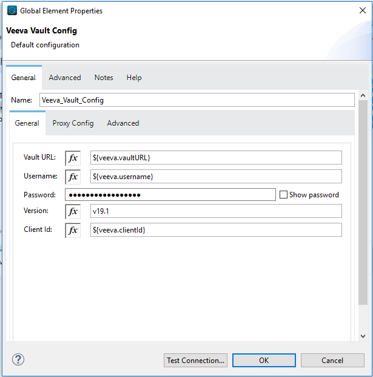

= VeevaVault Connector Studio Configuration - Mule 4
ifndef::env-site,env-github[]
include::_attributes.adoc[]
endif::[]
:imagesdir: ../../assets/images/

== Installing AnyPoint Studio

Before installing Studio 

. Install these components

* https://www.oracle.com/technetwork/java/javase/downloads/jdk8-downloads-2133151.html[Java.]
* https://maven.apache.org/download.cgi[Apache Maven]

. Download https://docs.mulesoft.com/studio/7.3/to-download-and-install-studio[Anypoint Studio] and install it.
. *Configure Maven:*

[loweralpha]
. Under the *Anypoint Studio* (Mac or Linux) or *Window* (Windows) menu, click *Preferences > Anypoint Studio > Maven*.
. Click *Browse* to locate the folder where you installed Maven.
. Click *Test Maven Configuration*. When the green checkmark is shown, click *OK*.
+
image:../../assets/images/veevavault/veevavault-connector-maven-test.png[image,width=531,height=386]

To configure a connector in Anypoint Studio:

. Add the connector to your Studio project
. Configure an input source for the flow
. Configure the connector

== Add the Connector to Your Project

Anypoint Studio provides two ways to add the connector to your Studio project: from the Exchange button in the Studio taskbar or from the Mule Palette view.

=== Add the Connector Using Exchange

. In Studio, create a Mule project.
. Click the Exchange icon *(X)* in the upper-left of the Studio task bar.
. In Exchange, click *Login* and supply your Anypoint Platform username and password.
. In Exchange, search for "*Veeva Vault*".
. Select the Veeva Vault connector and click *Add to project*.
. Follow the prompts to install the connector.

=== Add the Connector in Studio

. In Studio, create a Mule project.
. In the Mule Palette view, click *(X) Search in Exchange*.
. In *Add Modules to Project*, type "*Veeva Vault*" in the search field.
. Click the Veeva Vault connector name in *Available modules*.
. Click *Add*.
. Click *Finish*.

== Configure an Input Source for the flow

Configure an input source for the flow such as HTTP Connector - *HTTP Listener*, or *Scheduler*.

== Configure the Connector

To use VeevaVault Connector in your Mule app, configure a global VeevaVault element that can be used by all VeevaVault Connector operations in the application.

To configure this connector:

. To create a global element for the connector, click the *Global Elements* tab at the base of the canvas, and then click *Create*.
+
. In the *Choose Global Type* window, expand *Connector Configuration*, and click *Veeva Vault Config*.
+
. Click *OK*
+
. In the Veeva Vault Config window, *General* tab.
+

+
[cols=",",options="header",]
|===
|*Field* |*Description*
|*Name* |Enter a name for this configuration to reference it later.
|*Vault URL* |Enter Veeva Vault instance URL.
|*Username* |Enter the Veeva Vault instance username.
|*Password* |Enter the corresponding password.
|*Version* |Enter the Veeva Vault instance version (e.g: v19.1)
|*Client Id* |Enter Client Id in format *\{organisation}-{company\|team}* to send with each request in header for tracking purpose. The Client Id is prefix with *"mulesoft"* and suffix with *"client-vaultconnector"* internally. E.g : *mulesoft-abcpharma-clinicalprod-client-vaultconnector*
|===
+
In the image above, the placeholder values refer to a configuration file placed in the folder (src/main/resources) of your project. You can either hardcode your credentials into the global configuration properties or reference a configuration file that contains these values. For simpler maintenance and better re-usability of your project, Mule recommends that you use a configuration file. Keeping these values in a separate file is useful if you need to deploy to different environments, such as production, development, and QA, where your access credentials differ. E.g. Below is an example snippet of *configuration.yaml* file under folder (src/main/resources/config)
+
--------------------
	#Veeva Vault details
	veeva:
		vaultURL: "https://xxxx-xxxx.veevavault.com"
		username: "someone@example.com"
		password: "xxxxxxx"
		version : "v19.1"
		clientId: "mulesoft-abcpharma-clinicalprod-client-vaultconnector"
--------------------
+
The Connection Configuration will do Basic Authentication which will accept required parameters – *Vault URL, Username, Password* to perform connection with Veeva Vault instance to retrieve Session. The retrieved session will be used for each operation configured in Mule application for sending request.

. In the Veeva Vault Config window, *Advanced* tab.
+
image:../../assets/images/veevavault/veevavault-connector-basic-authentication-advanced.png[image,width=614,height=622]
+
*Burst API Limit Exceed Profile:*
+
The Burst API limit exceed profile configuration to act upon if Burst API limit of Veeva Vault API is exceeded or reach threshold configure.
+
By default, this option is enabled. If Burst API Limit Exceed Profile is enabled, then connector will evaluate Veeva APIs response header (*X-VaultAPI-BurstLimitRemaining*) value with API Limit threshold specified value. At Vault API burst limit remaining value exceed or reach this threshold value, the connector will wait for specified Wait time to roll over the Burst Limit Remaining in 5 minutes window.
+
Below is an example from the application logs showing a warning message at 2019-06-06 10:34:45,096 and subsequently waiting for 5 minutes before re-running as shown in the next message after 5 minutes at 2019-06-06 10:39:45,098.
+
--------------------

WARN 2019-06-06 10:34:45,096 [[MuleRuntime].io.27: [veevavault-connector-demo].get-documents-operationFlow.BLOCKING @2dd2ffaf] [event: 99716950-8818-11e9-90e2-d61515f42856] org.mule.extension.veevavault.internal.service.HttpRequestService: Burst API Limit remaining calls [1997] has exceeded/reached an API Limit Profile threshold set as [1997]. As per API Limit Profile, Veeva Vault Connector will wait for [5] MINUTES.

WARN 2019-06-06 10:39:45,098 [[MuleRuntime].io.27: [veevavault-connector-demo].get-documents-operationFlow.BLOCKING @2dd2ffaf] [event: 99716950-8818-11e9-90e2-d61515f42856] org.mule.extension.veevavault.internal.operations.VeevaVaultOperations: Properties or Fields is not available for api [/api/v18.2/metadata/objects/documents/types/site_management__c] , will use input list [[name__v, type__v, subtype__v, classification__v, lifecycle__v, status__v, study__v, product__v, id]] if configured to build VQL query

INFO 2019-06-06 10:39:45,098 [[MuleRuntime].io.27: [veevavault-connector-demo].get-documents-operationFlow.BLOCKING @2dd2ffaf] [event: 99716950-8818-11e9-90e2-d61515f42856] org.mule.extension.veevavault.internal.pagination.GetDocumentsPagingProvider: Query Build :: SELECT name__v, type__v, subtype__v, classification__v, lifecycle__v, status__v, study__v, product__v, id FROM documents WHERE name__v= 'F22611234--6764'

INFO 2019-06-06 10:39:46,024 [[MuleRuntime].io.27: [veevavault-connector-demo].get-documents-operationFlow.BLOCKING @2dd2ffaf] [event: 99716950-8818-11e9-90e2-d61515f42856] org.mule.extension.veevavault.internal.service.HttpRequestService: Response received for sync http request :: 'https://[vault-domain]/api/v18.2/query?q=SELECT+name__v%2C+type__v%2C+subtype__v%2C+classification__v%2C+lifecycle__v%2C+status__v%2C+study__v%2C+product__v%2C+id+FROM+documents+WHERE+name__v%3D+%27F22611234--6764%27++LIMIT+1000+OFFSET+0' in 925 milliseconds.

--------------------
+
[cols=",",options="header",]
|===
|*Field* |*Description*
|*API Limit Threshold* |Enter API threshold limit that Veeva API Burst limit reached or exceed this threshold, connector will wait for specified wait time. Default is 200.
|*Wait Time* |Enter Wait time for connector to wait if API Limit threshold is reached or exceeded. Default is 5 mins.
|*Time Unit* |Select time unit for wait time. Default is MINUTES.
|===
+
*Daily API Limit Exceed Profile:*
+
The Daily API limit exceed profile configuration (*Connector Configuration > Advanced Tab*) to act upon if Daily API limit of Veeva Vault API is exceeded or reach threshold configure. The Daily limit is the total numbers of API calls within any 24-hour window on a daily rolling basis.
+
By default, this option is enabled. If the Daily API Limit Exceed Profile is enabled, then connector will evaluate Veeva APIs response header (*X-VaultAPI-DailyLimitRemaining*) value with API Limit threshold specified value, the connector will throw an exception indicating the Daily API Limit is exceeded, the exception will continue for each and every jobs/request created until daily limit is reset or roll over next day.
+
Below is an example logs recorded which shows warning at *2019-06-06 10:47:31,698*, then an error is thrown at *2019-06-06 10:47:31,699*.
+
--------------------

WARN 2019-06-06 10:47:31,698 [[MuleRuntime].io.44: [veevavault-connector-demo].get-documents-operationFlow.BLOCKING @108e7f43] [event: 624cfa50-881a-11e9-90e2-d61515f42856] org.mule.extension.veevavault.internal.service.HttpRequestService: Veeva Daily API Limit remaining calls [10000] has exceeded/reached an Daily API Limit Profile threshold set as [10000]. As per API Limit Profile, Veeva Vault Connector will throw an exception.

ERROR 2019-06-06 10:47:31,699 [[MuleRuntime].io.44: [veevavault-connector-demo].get-documents-operationFlow.BLOCKING @108e7f43] [event: 624cfa50-881a-11e9-90e2-d61515f42856] org.mule.extension.veevavault.internal.service.HttpRequestService: Exception caught while processing Sync request ::: https://xxxxx-xxxxx.veevavault.com/api/v19.1/metadata/vobjects/site__v, Exception ::: \{"responseStatus":"FAILURE","errors":[\{"type":"API_LIMIT_EXCEED","message":"The Veeva Vault Connector has reached/exceeded daily API limit remaining calls [10000]. The configured daily api limit threshold is \(10000\)"}\]}

ERROR 2019-06-06 10:47:31,767 [[MuleRuntime].io.44: [veevavault-connector-demo].get-documents-operationFlow.BLOCKING @108e7f43] [event: 624cfa50-881a-11e9-90e2-d61515f42856] org.mule.runtime.core.internal.exception.OnErrorPropagateHandler:

**********************************************************************************

Message : An error occurred from the Veeva Vault API.
Error Code: API_LIMIT_EXCEED.
Original Error Message: The Veeva Vault Connector has reached/exceeded daily API limit remaining calls [10000]. The configured daily api limit threshold is (10000).
Error type : VEEVAVAULT:API_LIMIT_EXCEED

**********************************************************************************
--------------------
+

[cols=",",options="header",]
|===
|*Field* |*Description*
|*API Limit Threshold* |Enter API threshold limit that Veeva API Burst limit reached or exceed this threshold, connector will wait for specified wait time. Default is 10000.
|===
+
*Response Timeout:*
+
The maximum time in milliseconds that the connector will wait for the Veeva Vault response. If time elapse will throw Timeout Exception. By default, is 30,000 milliseconds.		
+
[cols=",",options="header",]
|===
|*Field* |*Description*
|*Response Timeout* |Enter timeout value for connector to wait for response from Veeva Vault instance. Default is 30 seconds.
|===

== Next Step

After configuring the Veeva Vault Connector for use in Studio, see the xref:./veevavault-connector-config-topics.adoc[Additional Configuration Information] 
topic for more configuration steps.

== See Also

https://help.mulesoft.com[MuleSoft Help Center]
